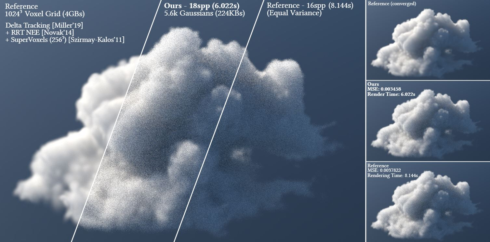
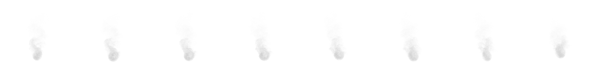
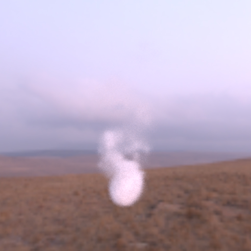

# Don’t Splat your Gaussians: Volumetric Ray-Traced Primitives for Modeling and Rendering Scattering and Emissive Media



Copyright (c) Meta Platforms, Inc. and affiliates. This source code is licensed under the MIT license found in the LICENSE file in the root directory of this source tree.

This repository contains the implementation of our novel approach associated with the paper ["Don't Splat Your Gaussians"](https://dl.acm.org/doi/10.1145/3711853) to modeling and rendering scattering and emissive media using volumetric primitives with the Mitsuba renderer. This repository contains the implementation of ray tracing volumetric primitives using the Mitsuba renderer, as described in our research paper. The project provides utility functions for IO, benchmarking, and several integrator algorithms for
rendering volumetric primitives.

Abstract: *Efficient scene representations are essential for many computer graphics applications. A general unified representation that can handle both surfaces and volumes simultaneously, remains a research challenge. Inspired by recent methods for scene reconstruction that leverage mixtures of 3D Gaussians to model radiance fields, we formalize and generalize the modeling of scattering and emissive media using mixtures of simple kernel-based volumetric primitives. We introduce closed-form solutions for transmittance and free-flight distance sampling for different kernels, and propose several optimizations to use our method efficiently within any off-the-shelf volumetric path tracer. We demonstrate our method as a compact and efficient alternative to other forms of volume modeling for forward and inverse rendering of scattering media. Furthermore, we adapt and showcase our method in radiance field optimization and rendering, providing additional flexibility compared to current state of the art given its ray-tracing formulation. We also introduce the Epanechnikov kernel and demonstrate its potential as an efficient alternative to the traditionally-used Gaussian kernel in scene reconstruction tasks. The versatility and physically-based nature of our approach allows us to go beyond radiance fields and bring to kernel-based modeling and rendering any path-tracing enabled functionality such as scattering, relighting and complex camera models.*

<section class="section" id="BibTeX">
  <div class="container is-max-desktop content">
    <h2 class="title">BibTeX</h2>
    <pre><code>@article{10.1145/3711853,
        author = {Condor, Jorge and Speierer, Sebastien and Bode, Lukas and Bozic, Aljaz and Green, Simon and Didyk, Piotr and Jarabo, Adrian},
        title = {Don't Splat your Gaussians: Volumetric Ray-Traced Primitives for Modeling and Rendering Scattering and Emissive Media},
        year = {2025},
        publisher = {Association for Computing Machinery},
        address = {New York, NY, USA},
        issn = {0730-0301},
        url = {https://doi.org/10.1145/3711853},
        doi = {10.1145/3711853},
        note = {Just Accepted},
        journal = {ACM Trans. Graph.},
        month = jan,
        keywords = {Volume Rendering, Scattering, Radiance Fields, 3D Reconstruction, Volumetric Primitives, Volumetric Representations, Ray Tracing, Inverse Rendering}
}</code></pre>
  </div>
</section>

## Installation

> 💥WARNING💥
>
> The implementation of the volumetric primitives required some changes in the Mitsuba renderer ([see associated PR](https://github.com/mitsuba-renderer/mitsuba3/pull/1464)). We are in the process of including those changes in the official codebase. Until then, you will need to build the [`ellispoids_release` branch](https://github.com/mitsuba-renderer/mitsuba3/tree/ellipsoids_release) of Mitsuba to use this repository.

To install the required dependencies, run:

```bash
pip install -r requirements.txt
```

or using conda:

```bash
conda env create --file environment.yml
conda activate volprim
```

Then install the `volprim` library to your local Python environment:
```bash
pip install -e .
```

## Integrators

This repository introduces integrators that can be used to render volumetric primitives for different applications:

- `volprim_rf`: VPRF integrator described in the paper, useful for rendering 3D Gaussian Splatting -like assets.
- `volprim_prb`: VPPT integrator described in the paper, useful for render volumetric scattering media.
- `volprim_tomography`: A simple tomography integrator that only accounts for the absorption in the volume.

## Example scripts

### `render_3dg_asset.py`

This script is a simple example of how to use Mitsuba to render a 3DG asset
from the original 3D Gaussian Splatting paper datasets. Such datasets can be downloaded on the [official 3D Gaussian Splatting website](https://repo-sam.inria.fr/fungraph/3d-gaussian-splatting/).

Example:
```
python .\examples\render_3dg_asset.py --ply datasets\truck\point_cloud\iteration_30000\point_cloud.ply --cameras datasets\truck\cameras.json
```

### `refine_3dg_dataset.py`


This script can be used to refine a 3DG asset to with our integrator, and different kernel. It will produce a Python asset that can later be rendered using the `render_asset.py` script.

Example:
```
python .\examples\render_3dg_asset.py --ply datasets\truck\point_cloud\iteration_30000\point_cloud.ply --cameras datasets\truck\cameras.json --images datasets\tandt_db\tandt\truck\images --output output_refine --cam_scale 0.125 --cam_count 4
```

### `render_asset.py`

This script can be used to render a Mitsuba Python asset resulting from an optimization pipeline.

Example:
```
python .\examples\render_asset.py output_refine\optimized_asset
```

### `optimize_volume.py`

<!-- <a> </a> -->


This script implements a simple optimization pipeline that converts a volume grid into a set of volumetric primitives. It uses the `volprim_tomography` integrators that integrates the density of overlapping volumetric primitives along the ray, with no scattering.

The resulting optimized set of volumetric primitives can then be rendered using the `render_volume.py` script as described below.

Example:
```
python examples/optimize_volume.py --output output_tomo --volume_grid resources/smoke.vol --cam_count 4 --cam_res 128
```

### `render_volume.py`



This script can be used to render a set of volumetric primitives representing a scattering media, using the `volprim_prb` integrator.

Example:
```
python .\examples\render_asset.py output_refine\optimized_asset
```

## License

This project is MIT licensed, as found in the LICENSE.md file.
